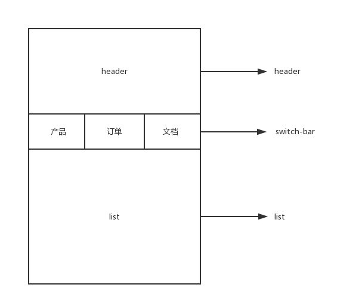
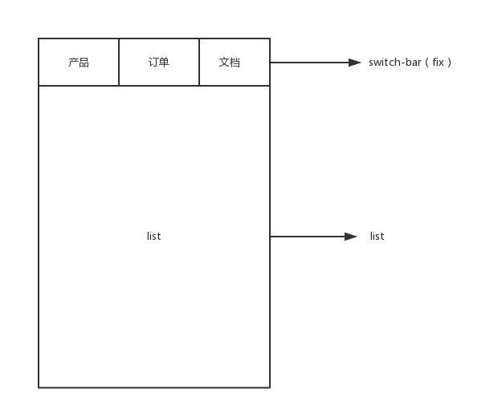
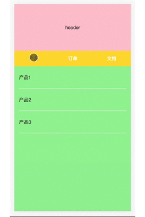

# Vue实现StickyTop效果

最近的wap项目开发中有这么一个需求：

1. 初始情况下页面布局如下图所示：



2. 当页面滚动距离大于`header`时，`switch-bar`将固定在顶部



3. 3个列表可以来回切换

4. 切换列表时保持`switch-bar`状态，即当`switch-bar`固定在顶部时，切换列表后`switch-bar`仍然固定在顶部，当`switch-bar`不固定在顶部时，切换列表后页面回跳到顶部。

5. 3个列表数据均为异步获取

最后的实现效果（简单示例）如下：


下面我们来看下如果实现这个`sticky`效果。

首先说一下这个示例的技术栈：`Vue` + `Vue-router` + `lodash` + `axios`

   ```
    使用`Vue-router`: 实现嵌套路由
    使用`lodash`的`throttle`: 节流监听滚动事件，降低性能小号
    使用`axios`: 发起异步请求
   ```

实现思路：

1. 页面使用流式布局，整个页面可分为4个组件（Home, Products, Orders, Docs

```
const Home = {
  template: `
  	<div class="home">
    	<header class="header">header</header>
      <div class="switch-bar">
        <router-link to="/products">产品</router-link>
        <router-link to="/orders">订单</router-link>
        <router-link to="/docs">文档</router-link>
      </div>
      <div class="content">
      	<router-view></router-view>
      </div>
	</div>`
}  

const Products = {
  template: 
  `
  	<ul class="list products">
  		<li v-for="item in list" :key="item.id">
  			{{ item.name }}
  		</li>
  	</ul>
  `
}

const Orders = {
  template: 
  `
  	<ul class="list products">
  		<li v-for="item in list" :key="item.id">
  			{{ item.name }}
  		</li>
  	</ul>
  `
}

const Docs = {
  template: 
  `
  	<ul class="list products">
  		<li v-for="item in list" :key="item.id">
  			{{ item.name }}
  		</li>
  	</ul>
  `
}
	  
```

2. 使用嵌套路由

```
const routes = [{
  path: '/',
  component: Home,
  children: [{
    path: '',
    component: Products
  }, {
    path: 'products',
    component: Products
  }, {
    path: 'orders',
    component: Orders
  }, {
    path: 'docs',
    component: Docs
  }]
}]
```

	
3. 节流监听`window`滚动事件，当**页面滚动高度 >= header**高度时，设置`switch-bar`的`position`属性为`fixd`，反之取消(实际通过一个变量`isFix`来控制样式)。

```
.home.fix .switch-bar {
	position: fixed;
	left: 0;
	top: 0;
	z-index: 10;
}
<div class="home" :class="{'fix': isFix}">
	...
	<div class="switch-bar">
		...
	</div>
	...
</div>


// 判断是否吸顶效果
if (this.scrollTop >= this.headerHeight) {
  this.isFix = true
} else {
  this.isFix = false
}
```

做完以上3点其实大部分工作就完成了，这时的运行效果如下：



有两个问题：

1. 切换列表时并没有保持`switch-bar`状态，因为示例中Products列表数比较少，导致**页面的高度 <= 屏幕的高度**，没有滚动条，当`switch-bar`固定在顶部并且从订单或文档切换过来时，由于**document.body.scrollTop = 0**，页面将跳到顶部
2. 当`switch-bar`固定在顶部时，切换列表，列表数据第一条并没有显示到正确的位置。

为了解决第一个问题，给`content`加了两个计算属性：`contentMinHeight`和`contentMarginTop`，动态计算`content`的`height`和`margin-top`

```
<div class="content" :style="{
    'minHeight': contentMinHeight + 'px',
    'marginTop': contentMarginTop + 'px'
    }">
<router-view></router-view>
</div>

computed: {
	contentMinHeight() {
	  const windowHeight = document.documentElement.clientHeight
	  return this.isFix ? windowHeight - this.switchBarHeight : windowHeight - this.headerHeight - this.switchBarHeight
	},
	contentMarginTop() {
	  return this.isFix ? this.switchBarHeight : 0
	}
}
```

为了解决第二个问题，watch `$route`的变化，手动将滚动条滚动至正确的位置

```
watch: {
	'$route'(to, from) {
	  this.$nextTick(() => {
	    if (this.isFix) {
	    	window.scrollTo(0, 0)  // 兼容chrome
	      window.scrollTo(0, this.headerHeight)
	    } else {
	      window.scrollTo(0, 0)
	    }
	  })
	}
}
```

到这里，整个示例就完成啦~

在线示例：

<script async src="//jsfiddle.net/hysunny/yvzyp4kk/2/embed/"></script>


